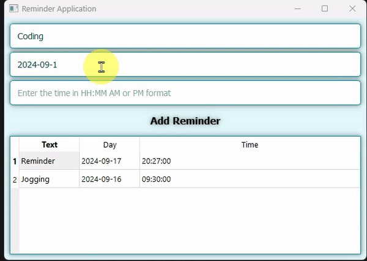

# Reminder Application

This is a Python-based Reminder Application that allows users to set reminders with specific dates and times and provides desktop notifications when the reminder time is reached. The app is built using the `qtpy` library for the GUI and saves reminders in an Excel file for persistent storage.

## Features

- **Add Reminders:** Users can add reminders with a message, date, and time.
- **Time and Date Based:** Reminders are set to trigger based on both the time and date.
- **Automatic Removal of Triggered Reminders:** Reminders are removed from the list after they are triggered.
- **Reminder Display:** A table view displays all added reminders.
- **Persistent Storage:** Reminders are saved to an Excel file (`reminder.xlsx`) so they persist between sessions.
- **Notifications:** Desktop notifications are triggered when it's time for a reminder.
- **Multi-threaded Checking:** Uses background threading to check for reminders without freezing the UI.
- **Modern UI Design:** Clean and professional user interface with visual elements.

## Prerequisites

Before running the application, you need to have Python installed and some required libraries. You can install Python from [here](https://www.python.org/downloads/).

### Required Python Libraries

- `pandas`: For reading and writing Excel files.
- `plyer`: For triggering desktop notifications.
- `qtpy`: For building the graphical user interface (GUI).
- `openpyxl`: For handling Excel files.

You can install these dependencies by running the following command:

```bash
pip install pandas plyer qtpy openpyxl
```
## Demo

